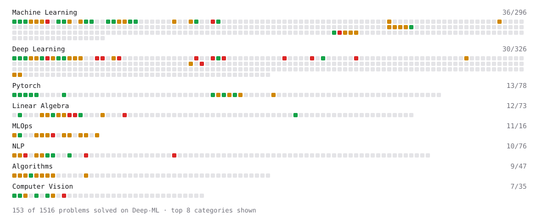

# Deep-ML

My machine learning practice from [Deep-ML](https://www.deep-ml.com). Every solution here was written by hand.

**Completed:** Pandas (7/7)

**102** solved · 92 problems · 2 labs · 8 math

[**Browse the interactive portfolio**](https://MobeenFatimaa.github.io/deep-ml/) to replay this filling in over time.

## Problems

| | Difficulty | Solved | |
| --- | --- | --- | --- |
| [Add a Bias Vector to a Batch via Broadcasting](https://www.deep-ml.com/problems/882) | easy | 2026-09-15 | [solution](problems/0882-add-a-bias-vector-to-a-batch-via-broadcasting) |
| [Add a Per-Group Average Column with GroupBy Transform](https://www.deep-ml.com/problems/1136) | easy | 2026-09-28 | [solution](problems/1136-add-a-per-group-average-column-with-groupby-transform) |
| [Backprop a Linear Layer by Hand](https://www.deep-ml.com/problems/898) | easy | 2026-09-18 | [solution](problems/0898-backprop-a-linear-layer-by-hand) |
| [Calculate 2x2 Matrix Inverse](https://www.deep-ml.com/problems/8) | easy | 2026-09-19 | [solution](problems/0008-calculate-2x2-matrix-inverse) |
| [Calculate Covariance Matrix](https://www.deep-ml.com/problems/10) | easy | 2026-09-25 | [solution](problems/0010-calculate-covariance-matrix) |
| [Calculate Perplexity for Language Models](https://www.deep-ml.com/problems/320) | easy | 2026-09-29 | [solution](problems/0320-calculate-perplexity-for-language-models) |
| [Calculate Unigram Probability from Corpus](https://www.deep-ml.com/problems/129) | easy | 2026-09-29 | [solution](problems/0129-calculate-unigram-probability-from-corpus) |
| [Compute a Gradient with PyTorch Autograd](https://www.deep-ml.com/problems/884) | easy | 2026-09-15 | [solution](problems/0884-compute-a-gradient-with-pytorch-autograd) |
| [Compute Multi-class Cross-Entropy Loss](https://www.deep-ml.com/problems/134) | easy | 2026-09-14 | [solution](problems/0134-compute-multi-class-cross-entropy-loss) |
| [Create a Float Tensor from a Python List](https://www.deep-ml.com/problems/880) | easy | 2026-09-15 | [solution](problems/0880-create-a-float-tensor-from-a-python-list) |
| [Derivatives of Activation Functions](https://www.deep-ml.com/problems/217) | easy | 2026-09-14 | [solution](problems/0217-derivatives-of-activation-functions) |
| [Exact Match Score with Normalization](https://www.deep-ml.com/problems/325) | easy | 2026-09-29 | [solution](problems/0325-exact-match-score-with-normalization) |
| [Feature Scaling Implementation](https://www.deep-ml.com/problems/16) | easy | 2026-09-27 | [solution](problems/0016-feature-scaling-implementation) |
| [Hamming Distance for Kanerva Coding](https://www.deep-ml.com/problems/647) | easy | 2026-09-24 | [solution](problems/0647-hamming-distance-for-kanerva-coding) |
| [Handle Missing Data in pandas (dropna/fillna)](https://www.deep-ml.com/problems/1128) | easy | 2026-09-28 | [solution](problems/1128-handle-missing-data-in-pandas-dropna-fillna) |
| [Implement a Linear Layer Forward Pass with Matrix Multiplication](https://www.deep-ml.com/problems/883) | easy | 2026-09-15 | [solution](problems/0883-implement-a-linear-layer-forward-pass-with-matrix-multiplication) |
| [Implement ReLU Activation Function](https://www.deep-ml.com/problems/42) | easy | 2026-09-14 | [solution](problems/0042-implement-relu-activation-function) |
| [Implement ReLU and Leaky ReLU](https://www.deep-ml.com/problems/1226) | easy | 2026-09-16 | [solution](problems/1226-implement-relu-and-leaky-relu) |
| [Implementation of Log Softmax Function](https://www.deep-ml.com/problems/39) | easy | 2026-09-14 | [solution](problems/0039-implementation-of-log-softmax-function) |
| [Label Encoding for Ordinal Variables](https://www.deep-ml.com/problems/356) | easy | 2026-09-26 | [solution](problems/0356-label-encoding-for-ordinal-variables) |
| [Leaky ReLU Activation Function](https://www.deep-ml.com/problems/44) | easy | 2026-09-14 | [solution](problems/0044-leaky-relu-activation-function) |
| [Linear Kernel Function](https://www.deep-ml.com/problems/45) | easy | 2026-09-27 | [solution](problems/0045-linear-kernel-function) |
| [Linear Regression Using Gradient Descent](https://www.deep-ml.com/problems/15) | easy | 2026-09-19 | [solution](problems/0015-linear-regression-using-gradient-descent) |
| [Linear Regression Using Normal Equation](https://www.deep-ml.com/problems/14) | easy | 2026-09-19 | [solution](problems/0014-linear-regression-using-normal-equation) |
| [Mean Squared Error from Scratch](https://www.deep-ml.com/problems/1228) | easy | 2026-09-16 | [solution](problems/1228-mean-squared-error-from-scratch) |
| [Min-Max Scaling of Feature Values](https://www.deep-ml.com/problems/112) | easy | 2026-09-26 | [solution](problems/0112-min-max-scaling-of-feature-values) |
| [Mode-Dependent Context Window Evaluation](https://www.deep-ml.com/problems/762) | easy | 2026-09-30 | [solution](problems/0762-mode-dependent-context-window-evaluation) |
| [PUCT Selection Rule for MCTS](https://www.deep-ml.com/problems/977) | easy | 2026-09-30 | [solution](problems/0977-puct-selection-rule-for-mcts) |
| [Random Shuffle of Dataset](https://www.deep-ml.com/problems/29) | easy | 2026-09-27 | [solution](problems/0029-random-shuffle-of-dataset) |
| [Reshape and Transpose a Tensor](https://www.deep-ml.com/problems/881) | easy | 2026-09-15 | [solution](problems/0881-reshape-and-transpose-a-tensor) |
| [Sigmoid Activation Function Understanding](https://www.deep-ml.com/problems/22) | easy | 2026-09-13 | [solution](problems/0022-sigmoid-activation-function-understanding) |
| [Single Linear Neuron Forward](https://www.deep-ml.com/problems/1224) | easy | 2026-09-15 | [solution](problems/1224-single-linear-neuron-forward) |
| [Single Neuron](https://www.deep-ml.com/problems/24) | easy | 2026-09-17 | [solution](problems/0024-single-neuron) |
| [Softmax Activation Function Implementation ](https://www.deep-ml.com/problems/23) | easy | 2026-09-14 | [solution](problems/0023-softmax-activation-function-implementation) |
| [Transpose of a Matrix](https://www.deep-ml.com/problems/2) | easy | 2026-09-20 | [solution](problems/0002-transpose-of-a-matrix) |
| [Alpha-Beta Pruning Implementation](https://www.deep-ml.com/problems/632) | medium | 2026-09-24 | [solution](problems/0632-alpha-beta-pruning-implementation) |
| [Asymmetric Uniform Quantization with Zero-Point](https://www.deep-ml.com/problems/1254) | medium | 2026-09-23 | [solution](problems/1254-asymmetric-uniform-quantization-with-zero-point) |
| [Best Meeting Point on a 2D Grid](https://www.deep-ml.com/problems/1085) | medium | 2026-09-24 | [solution](problems/1085-best-meeting-point-on-a-2d-grid) |
| [Binary Cross-Entropy from Logits](https://www.deep-ml.com/problems/1229) | medium | 2026-09-16 | [solution](problems/1229-binary-cross-entropy-from-logits) |
| [Build AlphaZero Training Targets from Self-Play](https://www.deep-ml.com/problems/979) | medium | 2026-10-01 | [solution](problems/0979-build-alphazero-training-targets-from-self-play) |
| [Calculate Eigenvalues of a Matrix](https://www.deep-ml.com/problems/6) | medium | 2026-09-21 | [solution](problems/0006-calculate-eigenvalues-of-a-matrix) |
| [Clean a Messy Dataset: Dedup, Standardize, Impute](https://www.deep-ml.com/problems/1131) | medium | 2026-09-28 | [solution](problems/1131-clean-a-messy-dataset-dedup-standardize-impute) |
| [Compute Pointwise Mutual Information](https://www.deep-ml.com/problems/111) | medium | 2026-09-29 | [solution](problems/0111-compute-pointwise-mutual-information) |
| [Critical Path Method for Scheduling](https://www.deep-ml.com/problems/637) | medium | 2026-09-24 | [solution](problems/0637-critical-path-method-for-scheduling) |
| [Cumulative Percentage of Scores by Bucket Within Each Grade](https://www.deep-ml.com/problems/1463) | medium | 2026-09-29 | [solution](problems/1463-cumulative-percentage-of-scores-by-bucket-within-each-grade) |
| [Derivative of Cross-Entropy Loss w.r.t. Logits](https://www.deep-ml.com/problems/220) | medium | 2026-09-18 | [solution](problems/0220-derivative-of-cross-entropy-loss-w-r-t-logits) |
| [Derivative of Softmax](https://www.deep-ml.com/problems/219) | medium | 2026-09-14 | [solution](problems/0219-derivative-of-softmax) |
| [Detect a Cycle in a Linked List and a Graph](https://www.deep-ml.com/problems/1087) | medium | 2026-09-24 | [solution](problems/1087-detect-a-cycle-in-a-linked-list-and-a-graph) |
| [Efficiently Find Duplicates in a Large Dataset](https://www.deep-ml.com/problems/1089) | medium | 2026-09-26 | [solution](problems/1089-efficiently-find-duplicates-in-a-large-dataset) |
| [Evaluate Translation Quality with METEOR Score](https://www.deep-ml.com/problems/110) | medium | 2026-09-29 | [solution](problems/0110-evaluate-translation-quality-with-meteor-score) |
| [Filter, Group, and Aggregate a DataFrame (Top-10 by Metric)](https://www.deep-ml.com/problems/1127) | medium | 2026-09-28 | [solution](problems/1127-filter-group-and-aggregate-a-dataframe-top-10-by-metric) |
| [Go Move Resolution with Captures](https://www.deep-ml.com/problems/981) | medium | 2026-10-01 | [solution](problems/0981-go-move-resolution-with-captures) |
| [Handle Imbalanced Data with SMOTE](https://www.deep-ml.com/problems/357) | medium | 2026-09-26 | [solution](problems/0357-handle-imbalanced-data-with-smote) |
| [Handle Missing Data with Imputation](https://www.deep-ml.com/problems/354) | medium | 2026-09-26 | [solution](problems/0354-handle-missing-data-with-imputation) |
| [Hash Function for Tile Coding](https://www.deep-ml.com/problems/644) | medium | 2026-09-24 | [solution](problems/0644-hash-function-for-tile-coding) |
| [Implement INT8 Quantization](https://www.deep-ml.com/problems/294) | medium | 2026-09-22 | [solution](problems/0294-implement-int8-quantization) |
| [Implement K-Fold Cross-Validation](https://www.deep-ml.com/problems/18) | medium | 2026-09-27 | [solution](problems/0018-implement-k-fold-cross-validation) |
| [Implement TF-IDF (Term Frequency-Inverse Document Frequency)](https://www.deep-ml.com/problems/60) | medium | 2026-09-29 | [solution](problems/0060-implement-tf-idf-term-frequency-inverse-document-frequency) |
| [Implementing Basic Autograd Operations](https://www.deep-ml.com/problems/26) | medium | 2026-09-18 | [solution](problems/0026-implementing-basic-autograd-operations) |
| [K-Means Clustering](https://www.deep-ml.com/problems/17) | medium | 2026-09-27 | [solution](problems/0017-k-means-clustering) |
| [Knapsack-Based ZeRO Bucket Assignment](https://www.deep-ml.com/problems/741) | medium | 2026-09-30 | [solution](problems/0741-knapsack-based-zero-bucket-assignment) |
| [Lazy Teacher Logit Reconstruction from Cached Hidden States](https://www.deep-ml.com/problems/746) | medium | 2026-09-30 | [solution](problems/0746-lazy-teacher-logit-reconstruction-from-cached-hidden-states) |
| [LCM-Aligned Heterogeneous KV Cache Block Layout](https://www.deep-ml.com/problems/752) | medium | 2026-09-30 | [solution](problems/0752-lcm-aligned-heterogeneous-kv-cache-block-layout) |
| [Matrix times Matrix ](https://www.deep-ml.com/problems/9) | medium | 2026-09-25 | [solution](problems/0009-matrix-times-matrix) |
| [Matrix Transformation ](https://www.deep-ml.com/problems/7) | medium | 2026-09-21 | [solution](problems/0007-matrix-transformation) |
| [Merge Multiple DataFrames](https://www.deep-ml.com/problems/1129) | medium | 2026-09-28 | [solution](problems/1129-merge-multiple-dataframes) |
| [Numerical Gradient Checking](https://www.deep-ml.com/problems/313) | medium | 2026-09-18 | [solution](problems/0313-numerical-gradient-checking) |
| [Numerically Stable Softmax](https://www.deep-ml.com/problems/1227) | medium | 2026-09-16 | [solution](problems/1227-numerically-stable-softmax) |
| [Optimal String Alignment Distance](https://www.deep-ml.com/problems/51) | medium | 2026-09-29 | [solution](problems/0051-optimal-string-alignment-distance) |
| [Outlier Detection and Removal Using IQR Method](https://www.deep-ml.com/problems/355) | medium | 2026-09-26 | [solution](problems/0355-outlier-detection-and-removal-using-iqr-method) |
| [Post-Training Quantization with Per-Channel Scale Factors](https://www.deep-ml.com/problems/426) | medium | 2026-09-23 | [solution](problems/0426-post-training-quantization-with-per-channel-scale-factors) |
| [Principal Component Analysis (PCA) Implementation](https://www.deep-ml.com/problems/19) | medium | 2026-09-27 | [solution](problems/0019-principal-component-analysis-pca-implementation) |
| [Quantization Scale Calibration (AbsMax and Percentile)](https://www.deep-ml.com/problems/1255) | medium | 2026-09-23 | [solution](problems/1255-quantization-scale-calibration-absmax-and-percentile) |
| [Reshape Data with pivot_table and melt](https://www.deep-ml.com/problems/1132) | medium | 2026-09-28 | [solution](problems/1132-reshape-data-with-pivot-table-and-melt) |
| [Robot Simulation on an Infinite Grid with Obstacles](https://www.deep-ml.com/problems/1142) | medium | 2026-09-24 | [solution](problems/1142-robot-simulation-on-an-infinite-grid-with-obstacles) |
| [SGD with Momentum Step](https://www.deep-ml.com/problems/1235) | medium | 2026-10-01 | [solution](problems/1235-sgd-with-momentum-step) |
| [Single Neuron with Backpropagation](https://www.deep-ml.com/problems/25) | medium | 2026-09-17 | [solution](problems/0025-single-neuron-with-backpropagation) |
| [Solve Linear Equations using Jacobi Method](https://www.deep-ml.com/problems/11) | medium | 2026-09-25 | [solution](problems/0011-solve-linear-equations-using-jacobi-method) |
| [Token-Granular Write-Ahead Log for Generation Resume](https://www.deep-ml.com/problems/747) | medium | 2026-09-30 | [solution](problems/0747-token-granular-write-ahead-log-for-generation-resume) |
| [Tree and Graph Coding Drills](https://www.deep-ml.com/problems/1090) | medium | 2026-09-26 | [solution](problems/1090-tree-and-graph-coding-drills) |
| [Tromp-Taylor Go Score](https://www.deep-ml.com/problems/982) | medium | 2026-10-01 | [solution](problems/0982-tromp-taylor-go-score) |
| [Two-Layer MLP Forward Pass](https://www.deep-ml.com/problems/1225) | medium | 2026-09-15 | [solution](problems/1225-two-layer-mlp-forward-pass) |
| [Beam Search with Memory-Efficient Block Sharing](https://www.deep-ml.com/problems/496) | hard | 2026-09-29 | [solution](problems/0496-beam-search-with-memory-efficient-block-sharing) |
| [Decision Tree Learning](https://www.deep-ml.com/problems/20) | hard | 2026-09-27 | [solution](problems/0020-decision-tree-learning) |
| [Determinant of a 4x4 Matrix using Laplace's Expansion (hard)](https://www.deep-ml.com/problems/13) | hard | 2026-09-25 | [solution](problems/0013-determinant-of-a-4x4-matrix-using-laplace-s-expansion-hard) |
| [GPT-2 Text Generation](https://www.deep-ml.com/problems/88) | hard | 2026-09-29 | [solution](problems/0088-gpt-2-text-generation) |
| [Implementing a Custom Dense Layer in Python](https://www.deep-ml.com/problems/40) | hard | 2026-09-17 | [solution](problems/0040-implementing-a-custom-dense-layer-in-python) |
| [MinHash for Near-Duplicate Document Detection](https://www.deep-ml.com/problems/766) | hard | 2026-09-29 | [solution](problems/0766-minhash-for-near-duplicate-document-detection) |
| [Monte Carlo Tree Search with Neural Policy and Value](https://www.deep-ml.com/problems/978) | hard | 2026-10-01 | [solution](problems/0978-monte-carlo-tree-search-with-neural-policy-and-value) |
| [Number Format Precision Comparison (FP16 vs BF16 vs FP8 vs FP4)](https://www.deep-ml.com/problems/428) | hard | 2026-09-23 | [solution](problems/0428-number-format-precision-comparison-fp16-vs-bf16-vs-fp8-vs-fp4) |
| [Off-Policy n-Step TD Prediction with Importance Sampling](https://www.deep-ml.com/problems/549) | hard | 2026-09-12 | [solution](problems/0549-off-policy-n-step-td-prediction-with-importance-sampling) |
| [Singular Value Decomposition (SVD) of 2x2 Matrix](https://www.deep-ml.com/problems/12) | hard | 2026-09-25 | [solution](problems/0012-singular-value-decomposition-svd-of-2x2-matrix) |

## Labs

| | Difficulty | Solved | |
| --- | --- | --- | --- |
| [Design Your Own Activation Function](https://www.deep-ml.com/labs/9) | easy | 2026-09-15 | [solution](labs/0009-design-your-own-activation-function) |
| [Train a Binary Classifier](https://www.deep-ml.com/labs/23) | easy | 2026-09-20 | [solution](labs/0023-train-a-binary-classifier) |

## Math

| | Difficulty | Solved | |
| --- | --- | --- | --- |
| [Derivatives and Gradients](https://www.deep-ml.com/math-problems/1) | easy | 2026-09-12 | [solution](math/0001-derivatives-and-gradients) |
| [Gradient Descent Updates](https://www.deep-ml.com/math-problems/5) | easy | 2026-09-13 | [solution](math/0005-gradient-descent-updates) |
| [Backpropagation and the Chain Rule](https://www.deep-ml.com/math-problems/4) | medium | 2026-09-16 | [solution](math/0004-backpropagation-and-the-chain-rule) |
| [Log-Likelihood Gradients](https://www.deep-ml.com/math-problems/38) | medium | 2026-09-13 | [solution](math/0038-log-likelihood-gradients) |
| [Matrix Calculus Identities](https://www.deep-ml.com/math-problems/35) | medium | 2026-09-17 | [solution](math/0035-matrix-calculus-identities) |
| [Neural Network Derivatives](https://www.deep-ml.com/math-problems/3) | medium | 2026-09-16 | [solution](math/0003-neural-network-derivatives) |
| [Softmax and Cross-Entropy](https://www.deep-ml.com/math-problems/32) | medium | 2026-09-13 | [solution](math/0032-softmax-and-cross-entropy) |
| [Uniform Quantization: Scale and Zero-Point](https://www.deep-ml.com/math-problems/45) | medium | 2026-09-22 | [solution](math/0045-uniform-quantization-scale-and-zero-point) |

---

_This file is regenerated by Deep-ML on every push._
